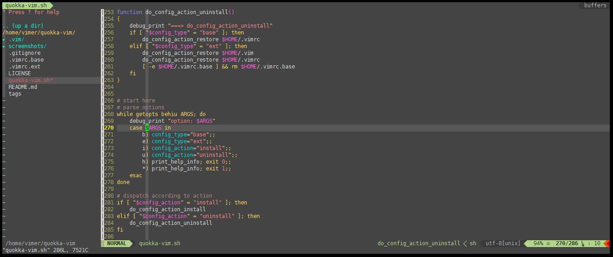

## quokka-vim

Love vim, love quokka smile.

Current Tested: Ubuntu 14.04, 16.04


## Installation

```bash
$ git clone https://github.com/shellever/quokka-vim.git
$ cd quokka-vim

# base vimrc
$ ./quokka-vim.sh -ib

# extended vimrc
$ ./quokka-vim.sh -ie
```


## Uninstallation

```bash
# base vimrc
$ ./quokka-vim.sh -ub

# extended vimrc
$ ./quokka-vim.sh -ue
```


## Screenshots

vimrc.ext



vimrc.base statusline


## Plugins

* [x] [Vundle.vim](https://github.com/VundleVim/Vundle.vim)
* [x] [NERDTree](https://github.com/scrooloose/nerdtree)
* [x] [NERDCommenter](https://github.com/scrooloose/nerdcommenter)
* [x] [Syntastic](https://github.com/scrooloose/syntastic)
* [x] [Tagbar](https://github.com/majutsushi/tagbar)
* [x] [ctrlp.vim](https://github.com/kien/ctrlp.vim)
* [x] [DoxygenToolkit.vim](https://github.com/vim-scripts/DoxygenToolkit.vim)
* [x] [YouCompleteMe](https://github.com/Valloric/YouCompleteMe)
* [x] [vim-airline](https://github.com/vim-airline/vim-airline)
* [x] [detorte](https://github.com/tamlok/detorte)


## License

MIT License. Copyright (C) 2018 Shellever.

